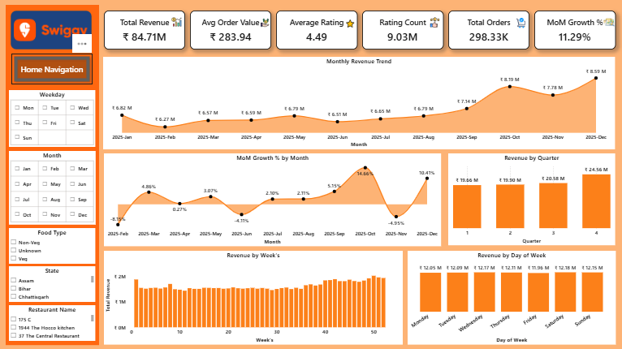
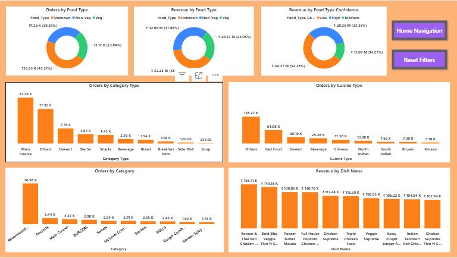
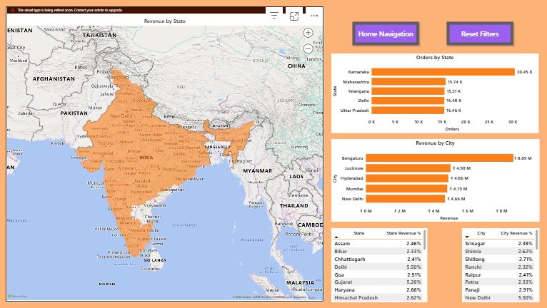
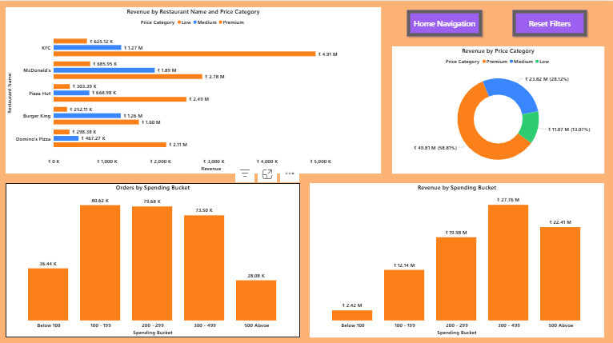
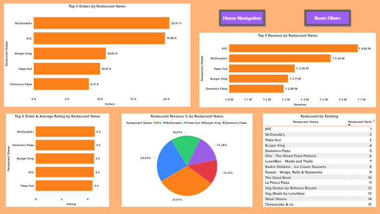
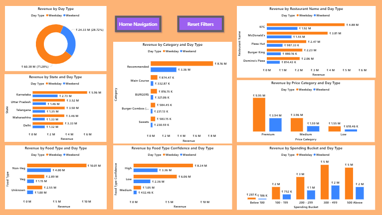

# Swiggy Revenue Analytics & Forecasting




End-to-End **Data Analytics and Revenue Forecasting project** analyzing Swiggy food delivery data using **SQL, Power BI, and Python (Facebook Prophet)**.

This project demonstrates how raw food delivery data can be transformed into **business intelligence dashboards and predictive forecasting models**.

---

# Project Workflow

The project follows a modern **analytics pipeline**:

Raw Data
↓
SQL Data Cleaning & Modeling
↓
Power BI Business Intelligence Dashboard
↓
Python Time Series Forecasting
↓
Revenue Predictions & Business Insights

---

## Installation

Clone the repository

[Click here for Git Clone](https://github.com/JaskarJeyabalan/swiggy-revenue-forecasting.git)

Install dependencies

pip install -r requirements.txt

Run forecasting script

python src/swiggy_revenue_forecasting.py

---

# Dataset

The dataset contains food delivery order data including:

* Order Date
* Restaurant Name
* City
* State
* Cuisine Type
* Food Category
* Order Price
* Customer Rating

⚠️ Due to GitHub file size limits, the dataset is hosted externally.

Download dataset here:

[Click here for Dataset Download](https://drive.google.com/drive/folders/1BDziEOhigVYpBFDCtlZwkU5gMn-P99e_?usp=sharing)

After downloading place files inside:

data/raw/

data/processed/

data/analytics/

---

# 1️⃣ SQL Data Preparation

The first stage of the project focuses on **data engineering using SQL**.

The SQL pipeline performs:

* table cleanup
* data cleaning
* dimension table creation
* fact table construction
* KPI analytics views

SQL scripts used:

```
00_drop_tables.sql
01_data_cleaning.sql
02_dimension_tables.sql
03_fact_table.sql
04_kpi_analysis.sql
05_analytics_view.sql
```

These scripts transform raw data into a **structured analytics dataset**.

---

# 2️⃣ Power BI Business Intelligence Dashboard

Power BI dashboards provide interactive insights into revenue performance.

## Business Overview


Key KPIs:

* Total Revenue
* Average Order Value
* Average Rating
* Total Orders
* Monthly Revenue Trend
* MoM Growth

---

## Food & Cuisine Insights



Insights include:

* Veg vs Non-Veg demand
* Cuisine popularity
* Category performance
* Dish level revenue

---

## Geographic Performance



Analysis includes:

* Revenue by State
* Orders by State
* Revenue by City

---

## Pricing & Spending Analysis



Customer spending patterns analyzed by:

* price category
* spending buckets
* restaurant pricing tiers

---

## Restaurant Performance



Insights include:

* top restaurants by revenue
* restaurant rankings
* order performance
* rating comparison

---

## Week-Based Performance



Demand analysis:

* weekday vs weekend revenue
* category demand by day
* spending patterns

---

# 3️⃣ Python Revenue Forecasting

After analyzing historical data, Python was used to **predict future revenue trends**.

The forecasting model uses **Facebook Prophet**, designed to capture:

* long-term trends
* seasonal effects
* demand fluctuations

Forecasts generated:

```
Daily Revenue Forecast
Weekly Revenue Forecast
Monthly Revenue Forecast
Weekday vs Weekend Forecast
Restaurant Revenue Forecast
City Revenue Forecast
Cuisine Revenue Forecast
Category Revenue Forecast
Price Category Revenue Forecast
State Revenue Forecast
```

---

# Model Evaluation

Model accuracy was evaluated using **time-series cross validation**.

Metrics used:

* MAE (Mean Absolute Error)
* RMSE (Root Mean Squared Error)
* MAPE (Mean Absolute Percentage Error)

---

# Forecast Data

Forecast output files are too large for GitHub.

Download here:

[Click here for Forecast Results](https://drive.google.com/drive/folders/1K_jo0VqTkQjzxjmaQs61Wl-uvwhe6Pep?usp=sharing)

Place them in:

```
forecasts/
```

---

# Project Structure

```
swiggy-revenue-forecasting
│
├── data
│
├── sql
│
├── dashboard
│
├── notebooks
│
├── src
│
├── forecasts
│
├── images
│
├── README.md
├── requirements.txt
├── LICENSE
└── .gitignore
```

---

# Future Improvements

Possible future improvements:

* integrate real-time order data
* deploy forecasting model using Streamlit
* include festival and holiday demand
* experiment with LSTM / XGBoost forecasting

---

# Author

**Jaskar Jeyabalan S**

Email: [jaskarjeyabalan@gmail.com](mailto:jaskarjeyabalan@gmail.com)

---

# License

This project is licensed under the MIT License.
